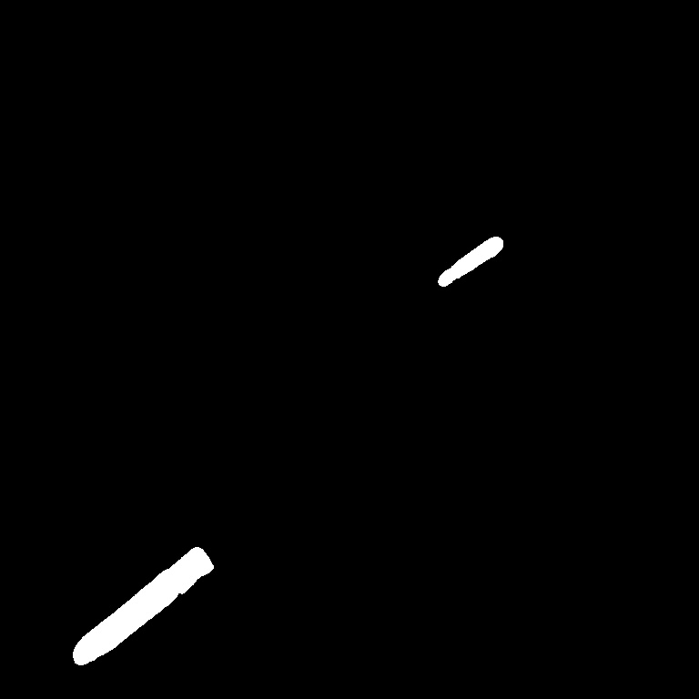

# Ship Images Segmentation
I used Unet model to solve this problem. The model was trained using only images that contains ships, because this images contains enough information for training convolution layers (images contains water, lands, etc). The dice coefficient on a validation dataset is equal to 0.4892. The model was trained during 5 epochs. More epochs can be required to improve the model, but it's take to much time to train.

Also I tried to train classification model based on pretrained EfficientNet. The idea was to classify if image contains ship and then do segmentation. But the results of classification model is not good, prediciton accuracy is weak.

Because target data contains in run-length encoding I build a generator based on Keras' Sequence class to train model and validate model.

Results:
Input | Output
:----:|:-----:
  |  
  |  
  |  
  |  